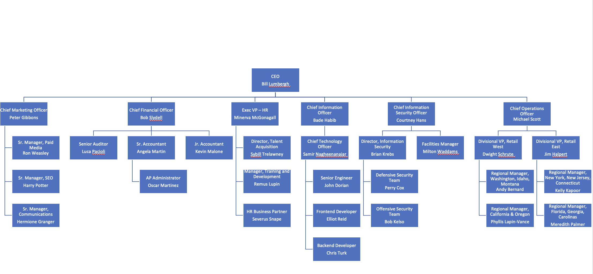

# Project Scenario

- Your team is tasked with updating the core IT infrastructure of a recent GlobeX acquisition, [SunToWater](https://suntowater.com/about-us-water-generator-team/). SunToWater's mission is to make water-from-air drinking water more accessible to families. This ecological, energy-conversion focus aligns well with the mission of GlobeX, but unfortunately, its IT systems do not.

- Because SunToWater currently lacks a client-server, domained network, your team is assigned with developing a repeatable means of standing up a DC to oversee SunToWater's network. The AD will need to automatically populate users and OUs in accordance with the organizational chart below: 

    - 

    - **Objective**: Develop as a team a Powershell script (or set of scripts which are called together) to be run on a new installation of Windows Server, can
    fully standup all requisite services to make the server into a DC. Minimum required components of the script are listed in the Project Guidelines document. Each individual of the team is to contribute their share of the overall script and document their individual contribution. The final script should reflect an equal effort from all team members.

> For the purposes of this project, only a single Windows 10 endpoint is required for demonstrating synchronization with the domain.

- Another pain point that GlobeX is experiencing is securely connecting SunToWater's field engineers to Globex corporate resources in the main office. The VP of Special Projects has explicitly requested your team develop a secure solution for data transmission between for these remote workers, and demonstrate successful resource access in your upcoming presentation to the executive team.  

    - **Objective**: Build a client-server VPN tunnel where one student hosts the VPN server and another students connects remotely as the client.

    - We've used pfSense and IPsec already, so you are encouraged to explore different tools. For instance, OPNsense is an alternative to pfSense, and openVPN is another VPN option. 

- Finally, SunToWater has experienced a number of network intrusions in the past which has caused management to be concerned with our plans to join the two networks. They've requested your team implement some form of network access control that provides a healthy level of AAA security management. Your upcoming presentation should demonstrate evidence of AAA in your final configuration.

    - **Objective**: Deploy a RADIUS system that raises a captive portal for new network users and authenticates them using AD credentials.

