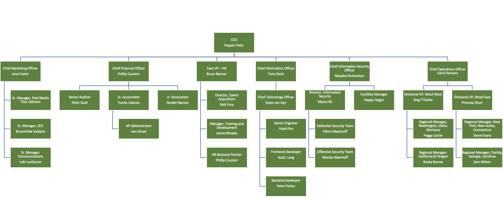

# Ops 301 Review, Ops 401 Preview, and Project Week Kickoff

## Scenario A: SunToWater

- Your team is tasked with updating the core IT infrastructure of a recent GlobeX acquisition, [SunToWater](https://suntowater.com/about-us-water-generator-team/). SunToWater's mission is to make water-from-air drinking water more accessible to families. This ecological, energy-conversion focus aligns well with the mission of GlobeX, but unfortunately, its IT systems do not.

- Because SunToWater currently lacks a client-server, domained network, your team is assigned with developing a repeatable means of standing up a DC to oversee SunToWater's network. The AD will need to automatically populate users and OUs in accordance with the organizational chart below: 

    - 

    - **Objective**: Develop as a team a singular Powershell script that, when executed on a new installation of Windows Server, can fully standup all requisite services to make the server into a DC. Minimum required components of the script are listed in the Project Guidelines document. Each individual of the team is to contribute their share of the overall script and document their individual contribution. The final script should reflect an equal effort from all team members.

> For the purposes of this project, only a single Windows 10 endpoint is required for demonstrating synchronization with the domain.

- Another pain point that GlobeX is experiencing is securely communicating to SunToWater's network resources. The VP of Special Projects has explicitly requested your team develop a secure solution for data transmission between the two networks, and demonstrate successful resource access in your upcoming presentation to the executive team.  

    - **Objective**: Build a site-to-site VPN tunnel, altering at least one parameter compared to what was performed in class (e.g. router used, cloud, etc.). Demonstrate successful access to a file server on the other end of the tunnel. 

- Finally, SunToWater has experienced a number of network intrusions in the past which has caused management to be concerned with our plans to join the two networks. They've requested your team implement some form of network access control that provides a healthy level of AAA security management. Your upcoming presentation should demonstrate evidence of AAA in your final configuration.

    - **Objective**: Deploy a RADIUS system that raises a captive portal for new network users and authenticates them using AD credentials.

## Scenario B: NET2GRID

- Your team is tasked with updating the core IT infrastructure of a recent GlobeX acquisition, [NET2GRID](https://www.net2grid.com/company). NET2GRID is a young, innovative company that offers leading-edge AI and machine learning services in energy insights based on smart meter data whose vision of a world with sustainable energy aligns well with the mission of GlobeX; unfortunately, its IT systems do not.

- Because NET2GRID currently lacks a client-server, domained network, your team is assigned with developing a repeatable means of standing up a DC to oversee NET2GRID's network. The AD will need to automatically populate users and OUs in accordance with the organizational chart below: 

    - 

    - **Objective**: Develop as a team a singular Powershell script that, when executed on a new installation of Windows Server, can fully standup all requisite services to make the server into a DC. Minimum required components of the script are listed in the Project Guidelines document. Each individual of the team is to contribute their share of the overall script and document their individual contribution. The final script should reflect an equal effort from all team members.

> For the purposes of this project, only a single Windows 10 endpoint is required for demonstrating synchronization with the domain.

- NET2GRID wishes to host some of its infrastructure on AWS EC2. A client-server VPN configuration will prove necessary to facilitate secure remote authentication to AWS EC2 resources. 

    - **Objective**: Build a working client-server VPN loadout from AWS EC2. Successfully connect a Windows 10 client to the AWS VPC. Demonstrate access to resources on AWS.

- Finally, NET2GRID has experienced a number of network intrusions in the past which has caused management to be concerned with the idea of sharing LAN resources with AWS EC2. They've requested your team implement some form of network access control that provides a healthy level of AAA security management on their local on-prem LAN. Your upcoming presentation should demonstrate evidence of AAA in your final configuration.

    - **Objective**: Deploy a RADIUS system that raises a captive portal for new network users and authenticates them using AD credentials.

[-top-](#top)
